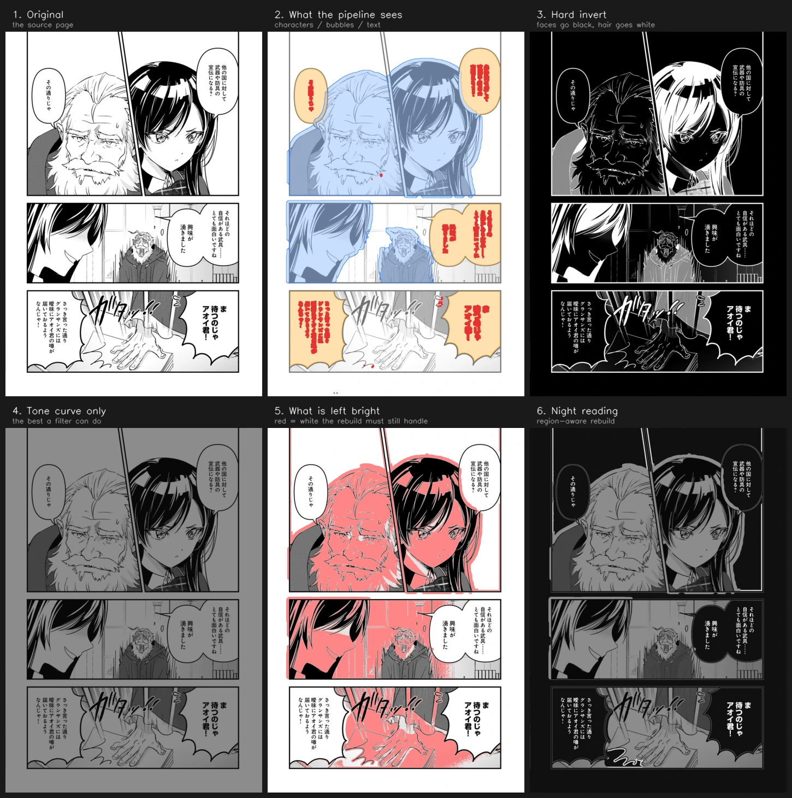

# yakuyomi-nightread

Night-reading mode for manga — the **page itself** gets dark, not just the UI.

English ｜ [中文](README_zh.md)

Every reader on the market does one of two things at night: paint the chrome black and leave the page
glaring white, or invert the whole image and wreck the art. Neither touches the page content. This project
does: it **rebuilds** the page. Speech bubbles become dark with light text, empty backgrounds are filled
black with the figures lifted out by a light outline, and everything else is tone-mapped so black lines stay
black.

It is the sibling of [yakuyomi-engine](https://github.com/joyeli/yakuyomi-engine) (the translation engine)
and consumes only its text-detection output.



**Status: desktop research.** Nothing ships yet. The pipeline has converged — 1351 lines of Python, 18
violations out of 665 guard boxes — and the remaining work is the Kotlin port. Decisions and current numbers
live in [`docs/DECISIONS.md`](docs/DECISIONS.md).

## Why a rebuild and not a filter

Manga's paper white is part of the composition: highlights on a face, glints on metal, and the gutter are all
drawn with the same white. Any global "white becomes dark" mapping flips the relationship between paper white
and screentone — unless the tones flip too, which is a negative. The inside of a speech bubble is the one
place inversion is perfect, and a filter can never reach it, because bubble white and paper white are the
same pixel value.

So the page has to be split into semantic regions first, then rebuilt region by region.


Full walkthrough in [`docs/ARCHITECTURE.md`](docs/ARCHITECTURE.md); every tunable in
[`docs/PARAMETERS.md`](docs/PARAMETERS.md); all eleven pages side by side in
[`docs/SHOWCASE.md`](docs/SHOWCASE.md).

## The red line

**Never paint over a face, a hand, a white sleeve or white hair.** The only acceptable failure is "not dark
enough". This is measured, not eyeballed: `nightread_guard.py` checks 704 hand-annotated foreground boxes,
and any output that darkens more than 15% of a box's originally-white pixels is a violation. The test exists
because visual inspection was proven unreliable — crops that looked clean were overturned once every box was
measured.

Reaching the red line needs a semantic character mask. Pure geometry tops out at 37 violations and costs 14
percentage points of light area; with the mask the same pipeline sits at 18.

## Layout

| Path | What |
|---|---|
| `research/nightread.py` | The whole pipeline, one page at a time. Every parameter is in one block at the top of the file. |
| `research/charmask.py` | The character-mask probe (CartoonSegmentation, YOLO11-seg, and their union). Its output is a **required input** to the pipeline. |
| `research/nightread_batch.py` | Run the 11 fixture pages, print the light-area table. |
| `research/nightread_guard.py` + `nightread_guard.json` | The red-line test: 704 hand-annotated foreground boxes. |
| `research/make_showcase.py` | The six-stage showcase sheets. |
| `research/pipeline_diagram.py` | The pipeline-stage figure at the top of this file. |
| `fixtures/pages/` | The 11 test pages. `fixtures/baseline/` holds reference outputs for regression. |
| `nightread/` | Future Kotlin library (Android library, **no `android.graphics` dependency** so JVM tests can compare against the Python fixtures bit-for-bit). Only the primitive API contract (`Cv.kt`) exists so far. |
| `docs/` | Architecture, parameter reference, decision log. |

## Running

The research scripts need the engine's parity tools for text detection (the DBNet checkpoint loader and the
m-i-t grouping spec). Point `YAKU_ENGINE_CLONE` at a checkout of yakuyomi-engine (default
`/mnt/d/Gits/Yakuyomi`); the same Python environment as its `parity/` works here.

```bash
cd research

# 1. character masks (required input — the pipeline refuses to run without them)
python3 charmask.py combine -o out/char_combine

# 2. the pipeline
NIGHTREAD_CHARMASK=$PWD/out/char_combine python3 nightread_batch.py -o out/run

# 3. the red-line test
python3 nightread_guard.py out/run
```

`NIGHTREAD_CHARMASK` is the only environment variable. Every other parameter is edited in the file, so a run
is reproducible from the source alone.

## License

GPL-3.0, same as the rest of Yakuyomi. The research pipeline uses the m-i-t DBNet detector (GPL-3.0) through
yakuyomi-engine; the character-mask models carry their own licences (CartoonSegmentation is MIT, YOLO11-seg
is AGPL-3.0); the rebuild algorithm itself is original.
