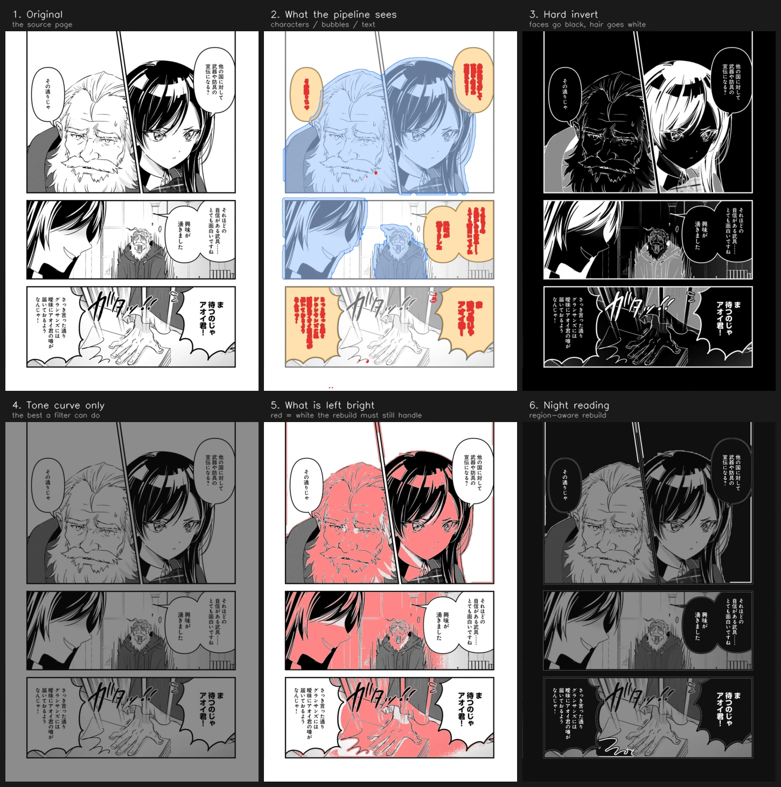
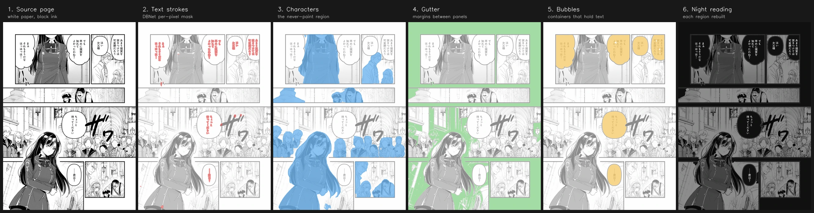

# yakuyomi-nightread

Night-reading mode for manga — the **page itself** gets dark, not just the UI.

English ｜ [中文](README_zh.md)

Every reader on the market does one of two things at night: paint the chrome black and leave the page
glaring white, or invert the whole image and wreck the art. Neither touches the page content. This project
does: it **rebuilds** the page. Speech bubbles become dark with light text, empty backgrounds are filled
black with the figures lifted out by a light outline, and everything else is tone-mapped so black lines stay
black.

Night reading stands on its own. It takes a page in greyscale, a text-region mask, the text-region boxes
and a character mask, and returns a dark page; where those inputs come from is the caller's choice. Yakuyomi
produces them with the DBNet detector in
[yakuyomi-engine](https://github.com/joyeli/yakuyomi-engine), which is one way of wiring it up, not a
requirement.



**Status: shipping.** `nightread/` is a complete Kotlin port, checked against the Python spec by parity tests,
and runs in Yakuyomi 0.23.0 (2026-10-08) through yakuyomi-engine's `:nightread-android`. The product has two
levels, Standard and More; the current rules version is 4. On the 688 scored guard boxes the full pipeline has
11 violations and both product levels 10 (the Kotlin library: 11 / 9 / 9). Decisions and current numbers live
in [`docs/DECISIONS.md`](docs/DECISIONS.md).

## Why a rebuild and not a filter

Manga's paper white is part of the composition: highlights on a face, glints on metal, and the gutter are all
drawn with the same white. Any global "white becomes dark" mapping flips the relationship between paper white
and screentone — unless the tones flip too, which is a negative. The inside of a speech bubble is the one
place inversion is perfect, and a filter can never reach it, because bubble white and paper white are the
same pixel value.

So the page has to be split into semantic regions first, then rebuilt region by region.



Full walkthrough in [`docs/ARCHITECTURE.md`](docs/ARCHITECTURE.md); every tunable in
[`docs/PARAMETERS.md`](docs/PARAMETERS.md); all eleven pages side by side in
[`docs/SHOWCASE.md`](docs/SHOWCASE.md).

## How it fits in the product

This section describes how Yakuyomi itself uses night reading. The pipeline does not require translation;
the ordering below is a product decision.

Night reading does not need translation: untranslated chapters can get night pages right after download.
For translated chapters it runs after translation: what it rebuilds is the finished page, with the translated
text already typeset into the bubbles. Computed before translation it would be looking at the original text,
and the translation pasted in afterwards would land as black type on a dark bubble. So OCR, translation,
inpainting and typesetting, the bulk of the translation cost, are all saved; the finished page only needs
detection run again, plus a night-reading-only character mask (two NCNN fp16 models in the engine, 146 MB
together: YOLO11-seg 20.4 MB and CartoonSegmentation 126 MB). The product also hands over two pieces of the
translation material: the original text boxes, merged with what DBNet finds again (short translated text is
often missed by detection), and, since rules version 4, the inpaint mask (`NightReadInput.inpaintMask`).
That detection cannot be saved was settled by
measurement: skipping it as well and using the typesetter's own exact
strokes scores best of the three recipes (text 239.3, contrast +223.2), and was then overturned by looking
at the output. Exact strokes cannot seed the bubble core fill (on one bubble the detected text region
covers 90% of the area, while the exact strokes are only 32% black), so the bubble does not fill and leaves
a grey patch in the bottom-right corner; and decorative hand-lettering sits inside no text region at all,
because the typesetter only knows what it drew itself and cannot see text that was never translated, so a
whole bubble is missed. Both the night version and the normal one are images computed ahead of time, so
switching is a file-pointer swap, zero computation. The full measurements of the three recipes and the
settled product shape are in [`docs/ARCHITECTURE.md`](docs/ARCHITECTURE.md).

## Using night reading on Android

This repo is the pure-Kotlin pipeline only. On Android it also needs text detection (DBNet) and the
character mask (two NCNN segmenters). Yakuyomi's implementation of both is in yakuyomi-engine, split so that
night reading does **not** need the translation engine:

| yakuyomi-engine module | What it brings |
|---|---|
| `:nightread-android` | `NightReadRenderer` (Bitmap in, dark Bitmap out) and the character segmenters. Depends on the two below. |
| `:inference-core` | the NCNN native layer (`libyakuyomi_ncnn.so`), the DBNet `Detector`, grouping, `ModelDownloader` |
| this library | the rebuild itself, pulled in by `:nightread-android` through `api` |

The translation module, `:engine`, is not involved.

To use it in an app:

1. Add yakuyomi-engine as a git submodule with `--recursive` (it carries this repo as its own submodule).
2. In `settings.gradle.kts`: `includeBuild("yakuyomi-engine")`.
3. In the app: `implementation("li.joye.yakuyomi:nightread-android:0.5.0")`. The version is a placeholder;
   the composite build substitutes the source.

Requirements: arm64-v8a only; NDK 28.2.13676358 and CMake 3.22.1 installed (`:inference-core` builds
`libyakuyomi_ncnn.so` from source); minSdk 26. Each included build looks for the Android SDK on its own, so
either set `ANDROID_HOME`, or put a `local.properties` with `sdk.dir=...` in both `yakuyomi-engine/` and
`yakuyomi-engine/yakuyomi-nightread/` (the app's own `local.properties` is not read there).

Models: from yakuyomi-engine's
[`models.json`](https://github.com/joyeli/yakuyomi-engine/blob/main/models.json), role `detector`
(`dbnet_detect.ncnn.param` + `.bin`) and role `charseg` (`manga_seg_s` and `cartoonseg`, `.param` + `.bin`
each), about 300 MB together. `ModelDownloader.fetchManifest()` filtered to those two roles, then
`ensure(...)`, downloads and checks them. Both are `suspend` functions, so call them from a coroutine (the
app needs its own kotlinx-coroutines dependency for that; `:inference-core` uses it internally without
exporting it), and `:inference-core` brings OkHttp and kotlinx-coroutines into the APK at runtime either way.
Load the models from a local path; do not read weights into the JVM heap with `readBytes()`. The two
segmentation models carry their own terms (YOLO11-seg: Ultralytics AGPL-3.0; redistributed for research and
non-commercial use, taken down on a rights holder's request): see
[the engine's model notes](https://github.com/joyeli/yakuyomi-engine/blob/main/docs/MODELS.md#night-reading-models).

```kotlin
import li.joye.yakuyomi.engine.Detector
import li.joye.yakuyomi.engine.NightReadRenderer
import li.joye.yakuyomi.nightread.NightTier

Detector(dir.resolve("dbnet_detect.ncnn.param").path).use { detector ->
    val seg = NightReadRenderer.charSegmenter(
        dir.resolve("manga_seg_s.ncnn.param").path,
        dir.resolve("cartoonseg.ncnn.param").path,
    ) ?: error("no character-segmentation model")
    seg.use {
        detector.warmUp(); it.warmUp()   // first-time native init on one thread, before running pages concurrently
        val night = NightReadRenderer.render(page, detector, it, NightTier.L2.apply())
    }
}
```

Two things to know. The Android classes are in the Kotlin package `li.joye.yakuyomi.engine`, not
`li.joye.yakuyomi.nightread` (they used to live in the engine module). And a page over 3.5 MPx is scaled down
first, so the output then has the scaled size. The full guide, including several tiers in one pass, threading
and memory, is
[`nightread-android/README.md`](https://github.com/joyeli/yakuyomi-engine/blob/main/nightread-android/README.md)
in yakuyomi-engine.

## The red line

**Never paint over a face, a hand, a white sleeve or white hair.** The only acceptable failure is "not dark
enough". This is measured, not eyeballed: `nightread_guard.py` checks 732 hand-annotated foreground boxes,
and any output that darkens more than 15% of a box's originally-white pixels is a violation. The test exists
because visual inspection was proven unreliable — crops that looked clean were overturned once every box was
measured.

Reaching the red line needs a semantic character mask. Pure geometry topped out at 37 violations (on the 665
boxes of the time) and cost 14 percentage points of light area; with the mask the full pipeline is at 11 of
today's 688 scored boxes.

## Layout

| Path | What |
|---|---|
| `research/nightread.py` | The whole pipeline, one page at a time. Every parameter is in one block at the top of the file. |
| `research/nightread_sep.py` | Any-angle gutter and margin detection (white between two near-parallel frame lines is a gutter); compose paints it above the character mask. |
| `research/nightread_bleed.py` | Bleed-panel filter: margin pieces whose outer ring touches artwork are dropped (skies and floors no longer torn into jagged black). |
| `research/nightread_ring.py` | Character ring thinning: where a drawn outline separates background from figure, the black grows up to it. |
| `research/nightread_obj.py` + `nightread_fx.py` | The "More" background-object rule, and effect lines / sparkles that do not count as objects. |
| `research/charmask.py` | The character-mask probe (CartoonSegmentation, YOLO11-seg, and their union). Its output is a **required input** to the pipeline. |
| `research/nightread_batch.py` | Run the 11 fixture pages, print the light-area table. |
| `research/nightread_guard.py` + `nightread_guard.json` | The red-line test: 732 hand-annotated foreground boxes. |
| `research/nightread_translated.py` | The translated-page material-sharing check: run night reading on the engine's finished page, compare the three detection-material recipes. |
| `research/make_showcase.py` | The six-stage showcase sheets. |
| `research/pipeline_diagram.py` | The pipeline-stage figure in *Why a rebuild and not a filter*. |
| `research/make_*_fixture.py` | Regenerate the Kotlin test resources in `nightread/src/test/resources/`. |
| `fixtures/pages/` | The 11 test pages. `fixtures/charmask/` holds the character masks for the 11 pages. `fixtures/baseline/tiers/<L1\|L2\|L3\|MORE>/` holds the per-level reference outputs that `TierParityTest` compares against. The `*_final.png` files directly under `fixtures/baseline/` are full-pipeline outputs from 2026-09-17 (dab92ab) and are no longer updated. |
| `nightread/` | The Kotlin library. The whole pipeline is ported and passes parity tests against the Python fixtures. Android library with **no `android.graphics` and no inference framework**; the source imports nothing beyond the Kotlin and JDK standard libraries (`kotlin.math`, `java.math`, `java.util.concurrent`), so the tests run on a plain JVM. Integration guide in [`nightread/README.md`](nightread/README.md). |
| `docs/` | Architecture, parameter reference, decision log. |

Character-mask inference is not in this repo. Yakuyomi computes it in
[yakuyomi-engine](https://github.com/joyeli/yakuyomi-engine)'s `:nightread-android` module with two NCNN segmenters, `CsegSegmenter`
(CartoonSegmentation's RTMDet-Ins) and `YoloSegSegmenter` (YOLO11-seg `manga_seg_s`), and feeds the union of
the two fp16 masks to the pipeline; int8 was measured on device and rejected. The former `nightread-ort`
module, which ran the same two models through ONNX Runtime, went away with that move, so nothing here depends
on ONNX Runtime any more. The research scripts still run the `.onnx` exports through Python `onnxruntime`;
that is the desktop reference the NCNN ports are checked against, not the product.

## Running

The research scripts need the engine's parity tools for text detection (the DBNet checkpoint loader and the
m-i-t grouping spec). Point `YAKU_ENGINE_CLONE` at a checkout of yakuyomi-engine (default
`/mnt/d/Gits/Yakuyomi`); the same Python environment as its `parity/` works here.

That dependency belongs to the scripts, not to the pipeline: they call the engine's DBNet to produce `seg`
and `regions`. Supply those two yourself and no engine is involved.
`run_page(page_path, outdir=OUT_DEFAULT, col_w=1000, regions=None, seg=None, diag=None, inpaint=None)` skips
detection when both are passed, which is the same shape as the Kotlin `NightReadInput`.

The character masks for the 11 fixture pages are already in `fixtures/charmask/`; set
`NIGHTREAD_CHARMASK=$PWD/../fixtures/charmask` and skip step 1. Regenerating them needs `cartoonseg.onnx` and
`manga_seg_s.onnx` in `research/out/models/` and Python `onnxruntime`. Dependencies: `research/requirements.txt`
plus the engine's `parity/` environment.

```bash
cd research

# 1. character masks (required input — the pipeline refuses to run without them)
python3 charmask.py combine -o out/char_combine

# 2. the pipeline
NIGHTREAD_CHARMASK=$PWD/out/char_combine python3 nightread_batch.py -o out/run

# 3. the red-line test
python3 nightread_guard.py out/run
```

`NIGHTREAD_CHARMASK` is the only required environment variable. The product levels and each rule's switch are
environment variables too (see the top of [`docs/PARAMETERS.md`](docs/PARAMETERS.md)); everything else is
edited in the file, so a run reproduces from the source.

## License

GPL-3.0, same as the rest of Yakuyomi. The research pipeline uses the m-i-t DBNet detector (GPL-3.0) through
yakuyomi-engine; the character-mask models carry their own terms (YOLO11-seg is Ultralytics AGPL-3.0;
CartoonSegmentation's repository has no LICENSE file, while the Hugging Face card of its original checkpoint
says MIT and the ONNX conversion we start from states nothing — details in
[the engine's model notes](https://github.com/joyeli/yakuyomi-engine/blob/main/docs/MODELS.md#night-reading-models));
the rebuild algorithm itself is original.
