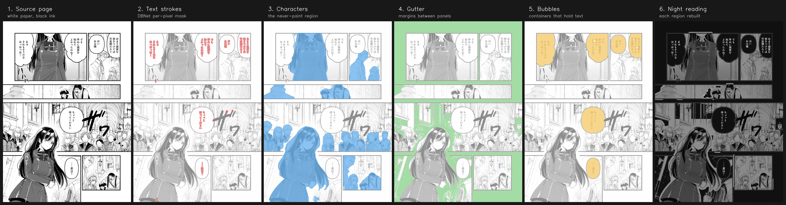
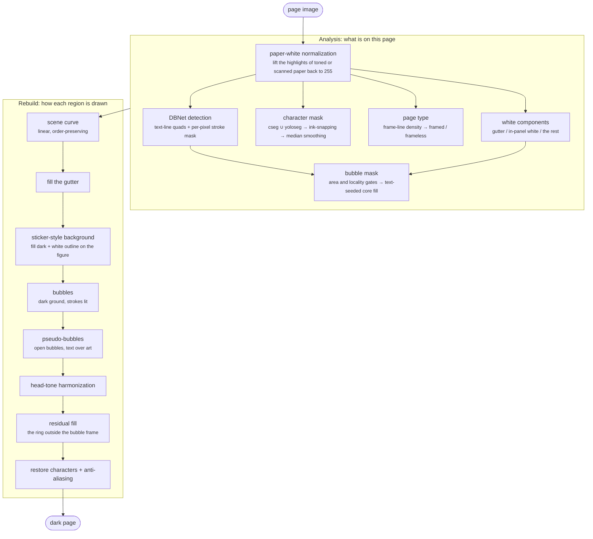
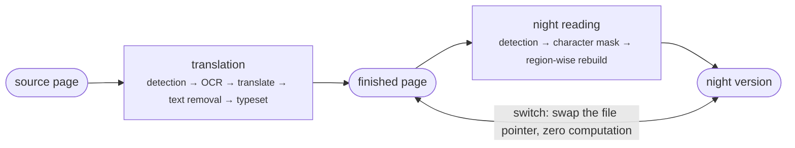

# Architecture

English ｜ [中文](ARCHITECTURE_zh.md)

How night-reading mode rebuilds a white manga page as a dark one, why a filter cannot do it, and what each
stage is deciding. Every tunable is listed in [PARAMETERS.md](PARAMETERS.md); where each decision came from,
and which alternatives lost, is in [DECISIONS.md](DECISIONS.md).

## Why a rebuild, not a filter

Readers on the market do one of two things at night: paint the chrome black, or invert the whole image. The
first never touches the page; the second wrecks the art. Nobody takes the path in between, because for a
global function that path is mathematically closed:

**Manga's paper white is part of the composition.** Highlights on a face, glints on metal, clouds, the
gutter — all drawn with the same paper white. Any global "white becomes dark" mapping flips the relationship
between paper white and screentone, unless the tones flip with it, which is a negative.

**The inside of a bubble is the exception.** There is nothing in there but line art, inversion is perfect
there, and dark-with-light-text is the most comfortable form night reading has. But a filter can never get at
it: bubble white and paper white are the same pixel value, and at the pixel level they are indistinguishable.

So darkening the page itself without wrecking the art means identifying the page's semantic regions first,
then rebuilding region by region. That is also the relationship to
[yakuyomi-engine](https://github.com/joyeli/yakuyomi-engine): this project consumes the engine's text
detection output and computes everything else itself.

## Per-page data flow



A page is first split into four independent judgements, then composed back. The first half is analysis
(what is on this page); the second half is the rebuild (how each region should be drawn).




The region decides the treatment:

| Region | Treatment |
|---|---|
| Gutter (page margins, panel gaps) | fill with `BG`, brighten the boundary |
| Plain white background (blank space inside a panel) | fill with `BG`, lift the foreground out with a white outline |
| Bubble interior | fill with `BG`, draw the text strokes up to `INK` |
| Characters | darkened by the scene curve; every fill gives way |
| The rest of the art | darkened by the scene curve |

## Stage by stage

**Paper-white normalization.** Scanned pages and tinted paper do not have their paper white at 255. demo05's
watercolour paper peaks at 223 — not one pixel on that page clears the white threshold, and every region test
downstream fails. The fix takes the mode of the bright end as the paper peak and linearly lifts it to 255 when
it sits below the threshold. The critical part is the chroma gate: real paper white is a neutral grey-white,
while a pale wash can be just as bright but coloured, and lifting that to white makes the output brighter
instead of darker.

**Detection.** DBNet (m-i-t's default detector) gives rotated quads for the text lines; its second output is a
per-pixel stroke mask. The stroke mask is what "draw the text bright" inside a bubble works from, and it is
also one of the signals for deciding whether a patch of white is a bubble. Region merging reuses m-i-t's
two-stage approach: a permissive connect pass, then a minimum spanning tree split that breaks apart neighbours
joined only transitively.

**Semantic character mask.** This is a *required* input, not an optional improvement. The guard boxes prove
the red line is unreachable without it: the best purely geometric recipe still left 37 violations, and paid 14
percentage points of light area to get there. The mask comes from `charmask.py`, the union of two
instance-segmentation models, CartoonSegmentation and YOLO11-seg.

The models produce their output at 640 resolution; scaled up to the full page, the boundary is a blocky
staircase and often stops inside the object. Two passes correct it:

- **Ink-snapping**: grow geodesically outward from the mask through non-ink pixels and stop at the line art. A
  character's outline is drawn ink to begin with, so the boundary ends up hugging the character, while
  background outside the outline cannot grow in. That property is the point: raising the radius does not
  thicken the boundary.
- **Median smoothing**: shaves off the blocky staircase. A median filter keeps straight edges and cuts
  protruding corners without shrinking the outline overall; a Gaussian cannot do both.

The last step of compose restores the character regions to scene tone. Putting it last is deliberate: any new
fill mechanism is protected automatically, with no per-mechanism change.

**Page type.** Measure the density of long straight panel borders (pixels of horizontal and vertical line per
thousand pixels). Below the threshold the page is a frameless page, and the background is only darkened, never
filled. This is a safe degradation: the failure direction is "not dark enough", not "art destroyed".

**White-component classification.** The page's white connected components are computed once, and gutter
detection and bubble detection share that one pass. Components touching the page edge are classified one by
one: a thick core reaching well into the page is in-panel white (the sky of a bleed panel), and one that
reaches in and wraps around line art is white-around-art — both are reclassified as art. What is left is true
gutter.

**Bubbles.** A white component intersected with a text region is a candidate, and two gates stop an entire
background from being taken for a bubble: a cap on its share of the page, and a locality rule — the area may
not exceed four times the text search window. A bubble large enough is not filled whole; it goes through
**text-seeded core fill** instead: start from the white inside the text boxes, open away the narrow necks,
keep only the wide region still connected to the text, then reclaim back to the ink lines. Background leaking
through a gap in the bubble outline, and face white connected in through the seam at a chin, are both cut off
at the neck — geometric protection, not threshold protection.

There is one more area ratio: the bubble core may not exceed 2.5 times the square of the text box's long side.
A real bubble is packed with text; a component where text sits on a cheek is a whole sheet of skin. The
denominator is the long side squared rather than the text box area, because a single vertical line of text has
a box only one line wide, and the area form would blow past the ratio spuriously.

**Sticker-style background.** Once plain white background is filled black the page loses its depth, so the
foreground needs a white outline to lift it out — the same vocabulary as the bubble's bright text on a dark
backing. Foreground and background separate on connectivity: white enclosed by ink (a face, clothing) is not
connected to the background white and survives untouched.

This layer carries the full safety net, because it is the one most likely to eat foreground white. The
component-level gates check foreground share, speckle share, chroma (which blocks pale-wash pages), and the
share of foreground white that looks eaten. The region-level protection recognizes attached white that can
only be reached through a narrow gap — the white-bearded old man's beard is exactly this shape — and leaves
the whole clump unfilled and un-outlined.

**Semantic release for core fill.** Core fill has two geometric protections: a geodesic-ratio veto (background
reaches the panel border in a straight line, cloth has to detour) and a thick-ink aura (no fill around a mass
of hair beside a face). Both are crude stand-ins from before the character mask existed, and both misfire: a
wedge of background pinned between a spear and a hair mass needs 468 pixels of detour to reach against a
euclidean distance of 130, and a ratio over the threshold left it standing as character-attached white. With a
semantic mask the test is far more direct: anything inside the core region that is definitively not a
character is released to be filled black. Before releasing, dilate the mask by 16 pixels as a safety margin,
or it bites into white shirt cuffs and hands.

**Pseudo-bubbles.** Open bubbles, bubble tails with a gap, and text written straight onto the art have no
closed white component to work with. A pseudo-bubble grows a tight dark backing outward from the white under
the text, with a light neck cut, so the text stays readable. The growth cap is the text box's long side; using
the short side leaves white between the characters of a horizontal title.

**Residual fill.** What remains of a bubble component after the core is subtracted is the background white
outside the bubble outline. It is neither gutter nor in-panel white, no mechanism picks it up, and the result
is the ring the user sees around the outside of the bubble. The decision has a semantic basis: this component
has already been identified as a white area containing a bubble, so what lies outside the bubble is the
background behind that bubble.

**Character restore and anti-aliasing.** The final step restores the character regions to scene tone, using a
small-radius Gaussian to soften the restore mask into a 0-to-1 alpha for blending, transitioning over one to
two pixels only. That kills the jaggies without producing a gradient the original art never had.

## Where it sits in the product

Night reading is downstream of translation, not a parallel branch.

**Order: night reading runs after translation finishes.** What it processes is the finished page with the
translated text already typeset onto it, not the original. Computed before translation, night reading sees the
source text, and the translation then lands on top as black glyphs on a black ground, completely unreadable.

**Translated text stays readable under night reading.** The material is real output from the translation
engine, run through the whole night-reading pipeline:

| Measurement | Value |
|---|---|
| Output brightness of the text strokes | 238.7 (ceiling 240) |
| Output brightness of the bubble ground | 16.1 |
| Contrast | +222.6 |
| Main bubbles short of contrast, out of six | 0 |

Translated text is easier to handle than native handwritten lettering: flat black glyphs have high ink density
and clean edges, so the low-ink knee that crushes to black cuts exactly where it should.

The measurement itself has a trap. Measuring "stroke mask ∩ bubble" directly gives 96.5, which looks too dark,
because 60.4% of the pixels in that mask are the bubble white around the glyphs rather than strokes. Measuring
readability means filtering the non-stroke pixels out first.

**What can be borrowed from translation.** Saved: OCR, translation, text removal and typesetting, which is the
bulk of translation's cost. Not saved: **detection**. The character mask is night reading's own cost, about
10.5 MB if only YOLO11-seg is used (nine more guard-box
violations), or 238 MB with CartoonSegmentation alongside it. CartoonSegmentation cannot be quantized:
its int8 build needs the score threshold dropped far enough that the mask over-covers and eats bubbles.

**Why detection cannot be saved.** Three recipes, measured:

| Recipe | Detection | Stroke mask | seg px | Light area | Text | Contrast |
|---|---|---|---|---|---|---|
| A, remeasure everything | DBNet | DBNet | 166919 | 6.47% | 238.7 | +222.6 |
| B, borrow the text regions | DBNet | DBNet | 166919 | 6.47% | 238.7 | +222.6 |
| C, borrow everything | not run | the typesetter's precise strokes | 51227 | 6.96% | 239.3 | +223.2 |

C is the best on the metrics, and **the images overturned it**. Two failure modes:

1. **The bubble does not fill.** DBNet's seg is a text **region**: on one bubble it covers 90% of that area,
   while the precise strokes are only 32% black. A bubble's core fill takes seg as its seed, and a seed that
   small leaves the bubble unfilled, with a patch of grey in the bottom right corner.
2. **A whole bubble is missed.** Decorative handwritten lettering lies inside no text region at all. The
   typesetter only knows what it drew itself and cannot see text that was never translated, and leaving
   decorative SFX untranslated is settled manga-image-translator policy.

The conclusion: DBNet's seg mask has two properties night reading depends on that the typesetter's precise
mask cannot give. It is a region rather than strokes, so it can serve directly as a fill seed; and it covers
all of the text.

B and A come out identical, because one DBNet forward pass produces the region and the stroke mask together,
so sharing the text regions saves no time. There is no reason to store extra material for sharing's sake
either.

**The settled product shape.**



The night version and the normal version switch freely, because both are images that have already been
computed.

## Two red lines

1. **Never paint the wrong thing.** Faces, hands, skin, white clothes and white hair must never be filled
   black. The only permitted failure direction is "not dark enough".
2. **Never invert the art.** The art region only ever gets a monotonic mapping; ink stays darker than paper.

The first is enforced by `nightread_guard.py`: 704 hand-annotated foreground boxes, and any output that paints
more than 15% of a box's originally-white pixels dark counts as a violation. The reason this test exists is
that **my own visual inspection was proven unreliable** — areas I had looked at in a crop and called clean were
overturned once every box was measured. Eyeballing does not count; the numbers do.

## Layer priority

Manga stacks as **text > bubble > character > background**. Text and bubbles sit on top, so they outrank
protecting the character.

The principle cannot be implemented bluntly. Simply letting the bubble beat the character breaks 17 guard
boxes, because the bubble mask overflows: when text is written on a face, the mask grows from the text out
across a whole sheet of white skin. All three tests for telling a real bubble from an overflow — distance from
the text, the ink ratio along the boundary, bubble-wins-outright — failed.

Two implementations do work:

- **Fill a clean bubble whole.** A real bubble is an empty container: after hole filling, the non-text ink
  inside it is 0 to 0.3%, while a face mistaken for a bubble has features and shadows and comes in above 1%. A
  component judged a real bubble is filled black whole and is not subtracted by the character mask.
- **Let only the text itself win.** Once the bubble mask has been subtracted by the character mask, the text
  in that area loses its bright-text-in-a-bubble treatment; the measured contrast is −6, meaning the text is
  darker than its own backing and completely unreadable. The fix is not to let the whole bubble win, but to
  leave the text strokes and their tight surround inside the subtracted bubble area un-restored, while the
  rest of the character stays protected.

## Where it stands

| Metric | Value |
|---|---|
| Guard-box violations | 18 / 665 |
| Light area (share of the output at ≥110) | 38.6% |
| Pipeline | 1351 lines of Python |

## Desktop research and the device port

| | Research (`research/`, Python) | Device (`nightread/`, Kotlin) |
|---|---|---|
| Role | the spec, and acceptance | the future product |
| Stack | numpy / cv2 / onnxruntime | Kotlin, ONNX Runtime, no `android.graphics` |
| State | converged, bit-for-bit reproducible | only the API contract in `Cv.kt` |

Python is the spec. The Kotlin port is accepted by comparing it bit for bit against the same fixtures, which
is also why `nightread/` deliberately avoids `android.graphics`: JVM tests have to be able to run it.

The model recipe for the device is settled. The character mask needs two ONNX models, 267MB together:
CartoonSegmentation (228MB, 58MB once int8) and YOLO11-seg (38.9MB). Detection reuses the engine's existing
DBNet, so it costs nothing extra.

The API is aligned too: `run_page` in `research/nightread.py` takes `regions` and `seg` parameters, and
supplying them from outside skips detection, the same shape as `NightReadInput` on the Kotlin side. Recipe C
being rejected does not make that interface useless; on the device it is still what decouples detection from
the rebuild.

## Repo layout

```
research/           desktop pipeline (the spec)
  nightread.py        the whole pipeline, one page at a time
  nightread_batch.py  run the 11 fixture pages, print the light-area table
  nightread_guard.py  the red-line test: 704 guard boxes
  charmask.py         character-mask probe (cseg / yoloseg / union)
  make_showcase.py    six-stage result sheet
fixtures/pages/     the 11 test pages
fixtures/baseline/  current outputs, for regression
nightread/          the future Kotlin library (only the API contract so far)
docs/               this file, the parameter reference, the decision record
```
