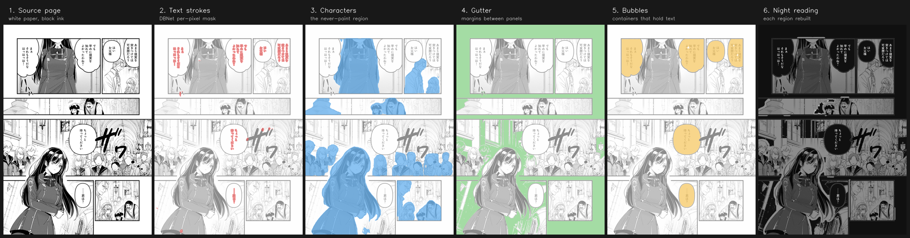
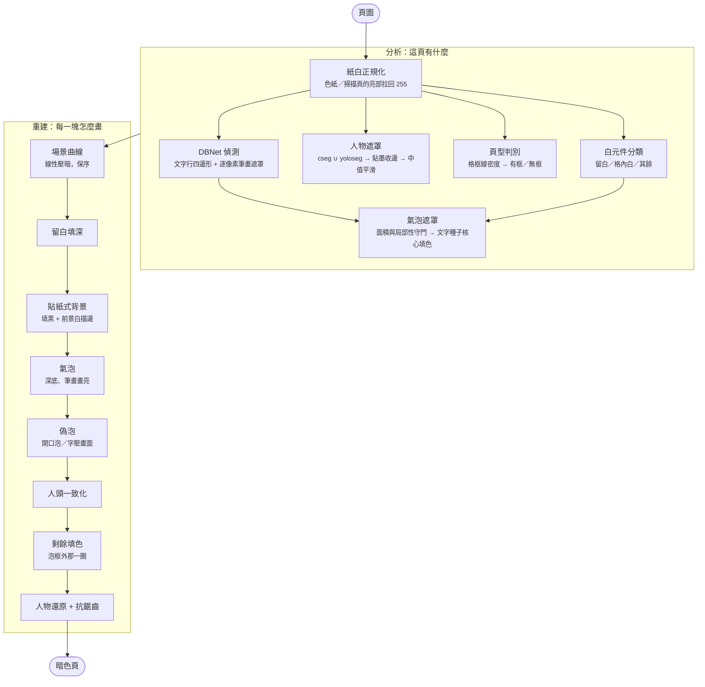

# 架構

[English](ARCHITECTURE.md) ｜ 中文

夜讀模式怎麼把一張白底漫畫頁重建成暗色頁、為什麼濾鏡做不到、每個階段在做什麼判斷。
參數逐項說明見 [PARAMETERS_zh.md](PARAMETERS_zh.md)，每個決策的由來與被否決的替代方案見
[DECISIONS.md](DECISIONS.md)。

## 為什麼是重繪，不是濾鏡

市面上的 reader 夜間只做兩件事：把介面塗黑、或把整張圖反相。前者不碰頁面，後者毀掉畫面。
中間那條路沒人走，因為它在數學上對全域函式是封死的：

**漫畫的紙白參與構圖。** 臉的亮部、金屬反光、雲、留白，全都用同一個紙白畫。任何「白變暗」的
全域映射都會翻掉「紙白 vs 網點」的相對關係，除非連調子一起翻，那就是負片。

**氣泡內部卻是例外。** 那裡只有純線稿，反相在那裡完美，深底白字正是夜讀最舒服的形式。但濾鏡
永遠拿不到它：泡的白和紙的白是同一個像素值，像素層不可分。

結論是，要讓頁面本身變暗又不毀畫面，必須先認出頁面的語意分區，再逐區重建。這也是這個專案和
[yakuyomi-engine](https://github.com/joyeli/yakuyomi-engine) 的關係：它只吃引擎的文字偵測輸出，
其餘自己算。

## 一頁的資料流



一頁先被拆成四份互相獨立的判斷，再合成回去。前半是分析（這頁有什麼），後半是重建
（每一塊該怎麼畫）。



分區決定待遇：

| 分區 | 待遇 |
|---|---|
| 留白（頁邊距、格溝） | 填 `BG`、邊界描亮 |
| 純白背景（格內的空白） | 填 `BG`、前景白描邊抬出立體感 |
| 氣泡內部 | 填 `BG`、文字筆畫畫亮到 `INK` |
| 人物 | 場景曲線壓暗，任何填色都要讓開 |
| 其餘畫面 | 場景曲線壓暗 |

## 每個階段

**紙白正規化。** 掃描頁和色紙的紙白不是 255。demo05 的水彩紙峰值只有 223，整頁沒有一個像素
達到白的門檻，後面整套分區都會失效。作法是取亮部眾數當紙白峰，低於門檻就線性拉到 255。關鍵是
彩度門：真紙白是灰白，淡彩畫底也可能很亮但有彩，把它拉白會讓輸出反而更亮。

**偵測。** DBNet（m-i-t 的預設偵測器）給文字行的旋轉四邊形，第二個輸出是逐像素的筆畫遮罩。
筆畫遮罩是氣泡內「畫亮字」的依據，也是判斷一塊白是不是泡的訊號之一。區域合併沿用 m-i-t 的兩階段
作法：寬鬆連邊，再用最小生成樹把只靠傳遞連起來的鄰居切開。

**人物語意遮罩。** 這是**必要輸入**，不是可選的加強。守護框證明沒有它紅線不可達：純幾何時代
最好的配方仍有 37 框違規，而且要付 14 個百分點的亮區代價。遮罩來自 `charmask.py`，是
CartoonSegmentation 與 YOLO11-seg 兩個實例分割模型的聯集。

模型原輸出在 640 解析度產生，放大到全頁後邊界呈方塊階梯，且常停在物體內側。兩道加工修正它：

- **貼墨收邊**：從遮罩出發，在非墨區內測地生長，碰到線稿就停。角色輪廓本來就是畫出來的墨線，
  所以邊界會貼合角色，而輪廓外的背景長不進來。這是關鍵性質，加大半徑不會讓邊界變粗。
- **中值平滑**：削掉方塊階梯。中值濾波保直線、削突出的角，不會讓整體輪廓縮水，高斯做不到這點。

合成的最後一步把人物區還原成場景調。放在最後是刻意的：任何新加的填色機制都自動受保護，
不必逐一修改。

**頁型判別。** 量長直格框線的密度（每千像素多少像素的橫線與直線）。不到門檻就是無框頁，
背景只壓暗不填深。這是安全降級，失敗方向是「不夠暗」而不是「毀畫面」。

**白元件分類。** 整頁的白連通元件一次算完，留白與氣泡共用同一份。貼頁邊的元件逐顆分類：
厚芯大量深入頁內的是格內白（出血格的天空），深入且包住線稿的是「白包畫」，兩者都改判畫面。
其餘才是真留白。

**氣泡。** 白元件與文字區的交集是候選，兩道守門擋掉整片背景被當成泡：整頁佔比上限，以及
「面積不得超過文字搜尋窗的四倍」的局部性。夠大的泡不整顆填，改走**文字種子核心填色**：
從字框內的白出發，開運算切掉窄頸，只留與字連通的寬闊區，再往墨線回收。泡框缺口漏出的背景、
經下巴縫連進來的臉白都在頸口被切斷，是幾何保護不是門檻保護。

還有一道面積比：泡核心不得超過字框長邊平方的 2.5 倍。真泡的字塞得滿，字壓在臉頰上的元件
則是整片皮膚。分母用長邊平方而不是字框面積，是因為單行直排的字框只有一行寬，用面積會假性爆表。

**貼紙式背景。** 純白背景填黑之後畫面會失去立體感，所以前景要加白描邊抬出來，和氣泡的
「深底亮字」是同一套語彙。前景與背景的分離靠連通性：被墨線封閉的白（臉、衣服）不與背景白
連通，天然保留。

這一層有完整的安全網，因為它最容易吃掉前景白。元件級的門檢查前景佔比、細碎佔比、彩度
（擋淡彩頁）、以及「疑似被吃的前景白」比例；區域級的保護則認出「只能經窄縫抵達的附屬白」
，白鬍老人的鬍鬚就是這型，整團不填不描。

**核心填色的語意放行。** 核心填色有兩道幾何保護：測地比刪填（背景從格框直直就到，衣料要繞路）
和厚墨灰暈（臉旁髮團周圍不填）。兩者都是人物遮罩出現前的粗略替代品，而且會誤傷：被長矛和髮團
夾住的背景楔形要繞 468 像素才走得到，直線距離只有 130，比值超過門檻就被當成人物附屬白留了下來。
有語意遮罩之後判準直接得多：核心區裡明確不是人物的部分一律放行去填黑。放行前把遮罩外擴 16 像素
當安全邊界，否則會咬到白襯衫袖口和手。

**偽泡。** 開口泡、泡尾缺口、字直接寫在畫面上，這些情況沒有封閉的白元件可用。偽泡從字底的白
輕切頸生長出一圈貼身的深色襯底，讓字仍然可讀。生長上限用字框的長邊，用短邊會讓橫排標題字
之間留白。

**剩餘填色。** 泡元件減掉核心之後剩下的是泡框外的背景白，它既不是留白也不是格內白，沒有任何
機制會接手，結果就是使用者看到的「泡泡外面那一圈」。判定有語意根據：這個元件已經被認定為
含氣泡的白區，氣泡以外就是氣泡外的背景。

**人物還原與抗鋸齒。** 最後把人物區還原成場景調，用小半徑高斯把還原遮罩軟化成 0 到 1 的
alpha 做混合，只在 1 到 2 像素內過渡。這消掉鋸齒又不會產生原作沒有的漸層。

## 兩條紅線

1. **絕不塗錯。** 臉、手、皮膚、白衣、白髮絕不可以被填黑。失敗方向只准「不夠暗」。
2. **畫面絕不反相。** 畫面區只允許單調映射，墨線永遠比紙面暗。

第一條靠 `nightread_guard.py` 驗收：704 個人工標註的前景框，任何輸出只要把某框內原本是白的
像素塗黑超過 15%，就算違規。這套測試存在的理由是**我的目視驗證被證明不可靠**——我看過裁圖
說「完整」的區域，後來逐框量測全被推翻。目視不算數，數字才算。

## 圖層優先權

漫畫的疊法是 **字 > 對話框 > 人物 > 背景**。壓在最上面的是字和對話框，所以它們的權重比
保護人物更高。

這條原則不能粗暴實作。單純讓「泡贏過人物」會弄壞 17 個守護框，因為泡遮罩會溢出：字寫在臉上時，
泡遮罩會從字一路長到整片白皮膚。分辨真泡與溢出的三種判準（離字距離、邊界墨線比、泡全贏）
全部失敗。

可行的實作是兩條：

- **乾淨泡整顆塗黑**。真泡是空白容器，填洞後內部的非字墨只有 0 到 0.3%；臉被誤判成泡則有
  五官和陰影，超過 1%。判定為真泡的整顆塗黑，不被人物遮罩扣。
- **只讓字本身贏**。泡遮罩被人物扣掉後，那塊區域的字會失去泡內亮字的待遇，實測對比是 −6，
  字比底還暗、完全讀不出來。修法不是讓整顆泡贏，而是讓被扣掉的泡區裡的字筆畫及其貼身帶
  不還原，人物的其餘部分照樣受保護。

## 現況

| 指標 | 值 |
|---|---|
| 守護框違規 | 18 / 665 |
| 亮區（成品 ≥110 的比例） | 38.6% |
| 管線 | 1351 行 Python |

## 桌面研究與上機的關係

| | 研究端（`research/`，Python） | 上機（`nightread/`，Kotlin） |
|---|---|---|
| 角色 | 規格與驗收 | 未來的產品 |
| 技術棧 | numpy / cv2 / onnxruntime | Kotlin、ONNX Runtime、無 `android.graphics` |
| 現況 | 收斂，逐位元可重現 | 只有 `Cv.kt` 的 API 契約 |

Python 是規格本。Kotlin 移植的驗收方式是對同一批 fixture 逐位元比對，這也是
`nightread/` 刻意不依賴 `android.graphics` 的原因：JVM 測試才跑得起來。

上機的模型配方已經定了。人物遮罩需要兩顆 ONNX 模型，合計 267MB：CartoonSegmentation（228MB，
int8 可壓到 58MB）與 YOLO11-seg（38.9MB）。偵測沿用引擎既有的 DBNet，不另外花空間。

## Repo 佈局

```
research/           桌面管線（規格）
  nightread.py        整條管線，一次一頁
  nightread_batch.py  跑 11 張 fixture、印亮區表
  nightread_guard.py  紅線測試：704 個守護框
  charmask.py         人物遮罩探針（cseg / yoloseg / 聯集）
  make_showcase.py    六階段成果展示圖
fixtures/pages/     11 張測試頁
fixtures/baseline/  現行輸出，回歸用
nightread/          未來的 Kotlin library（目前只有 API 契約）
docs/               這份文件、參數表、決策記錄
```
