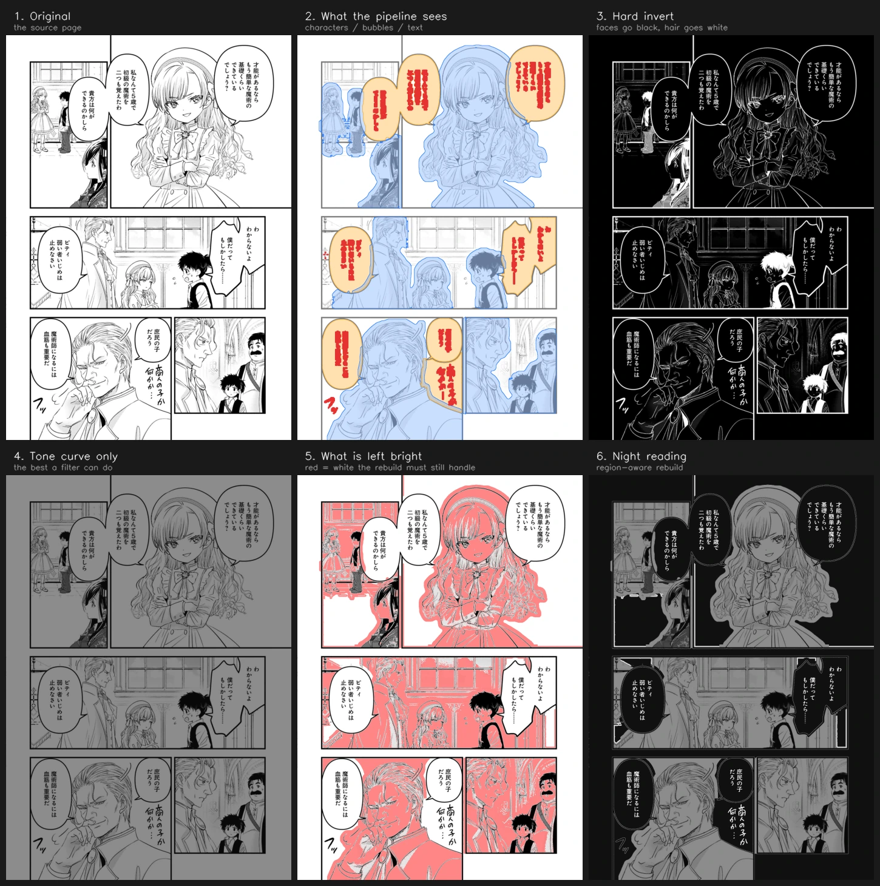
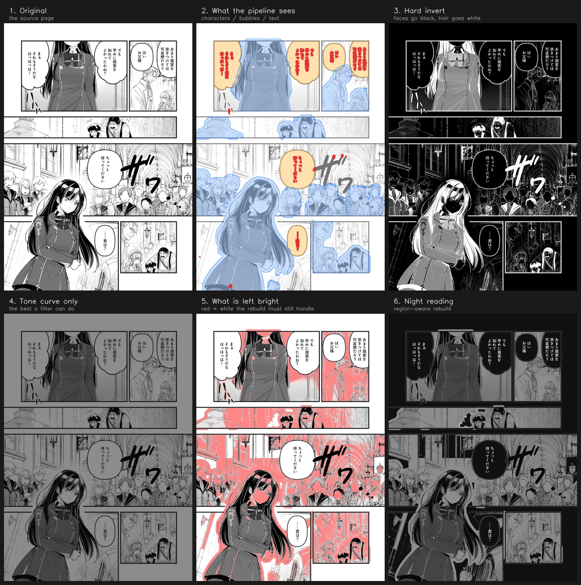
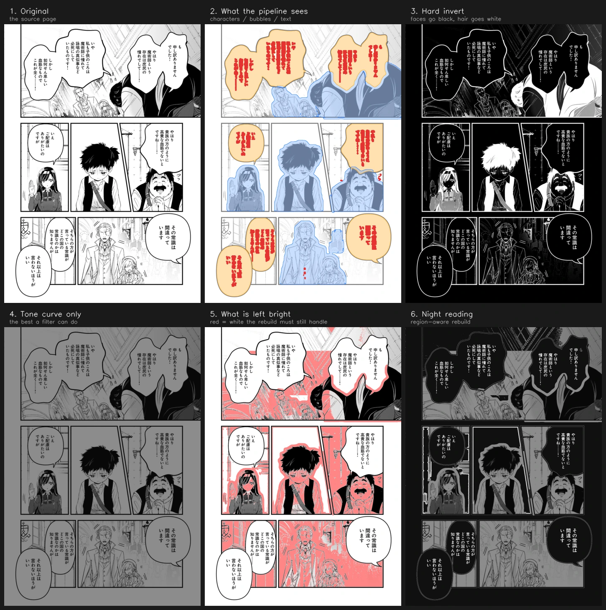
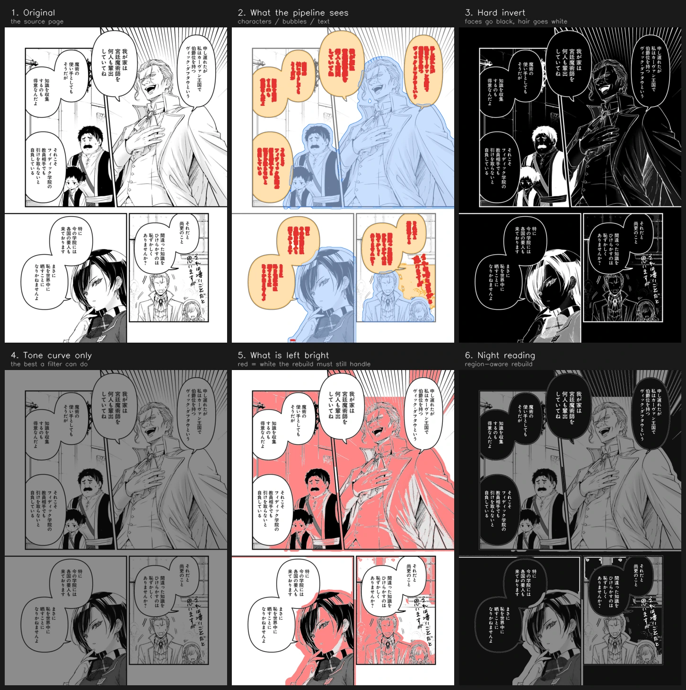
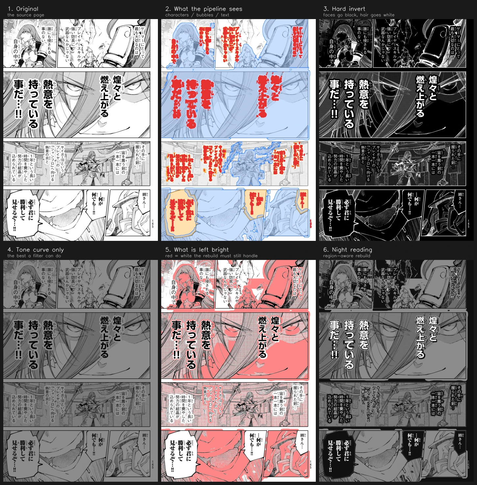
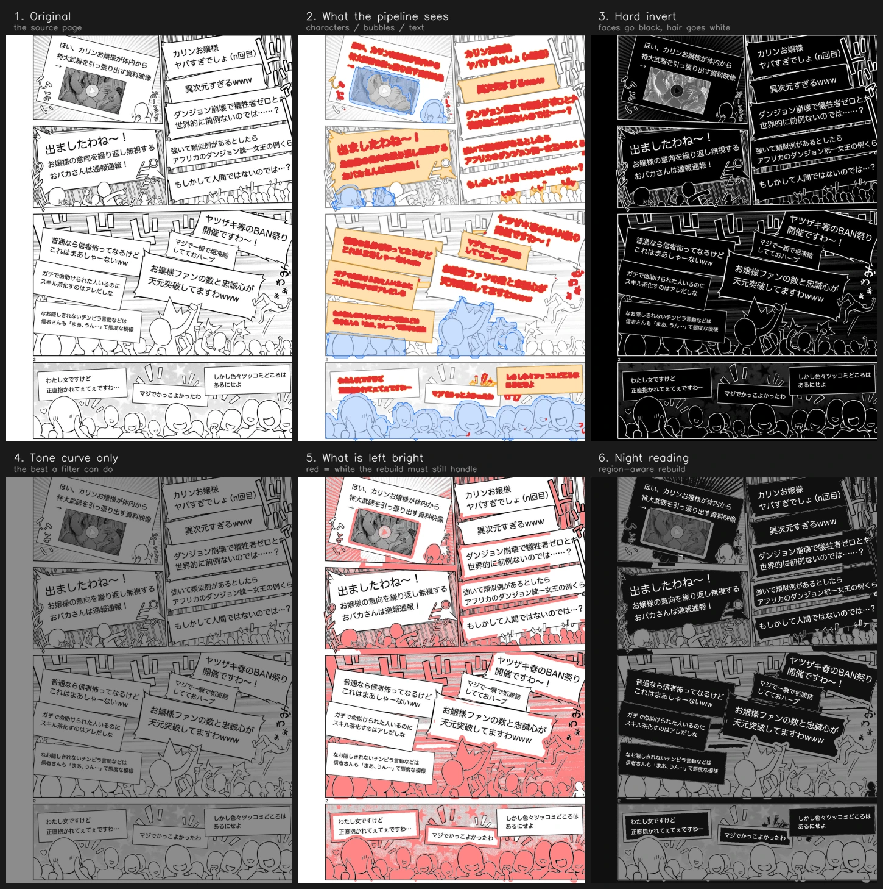
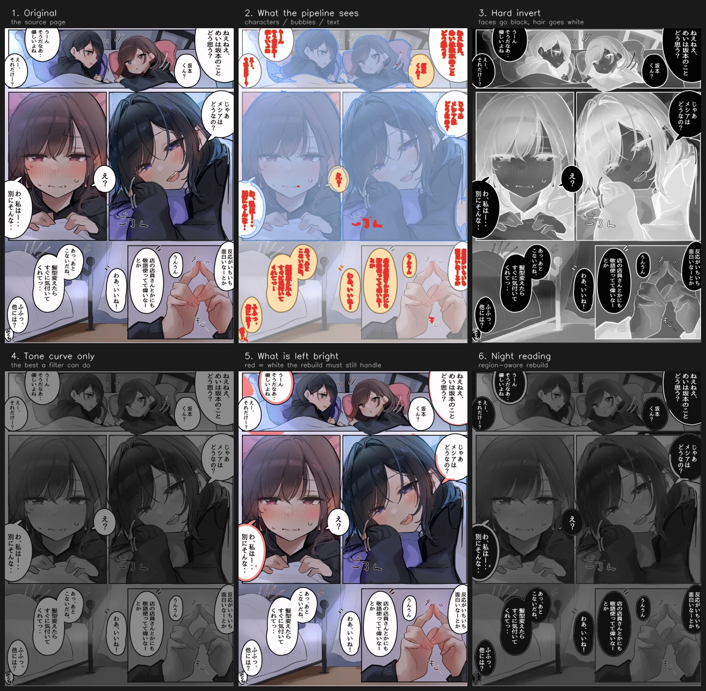
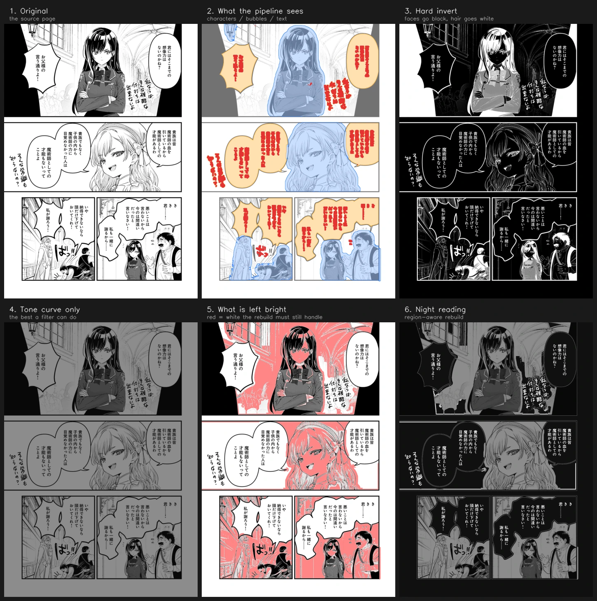
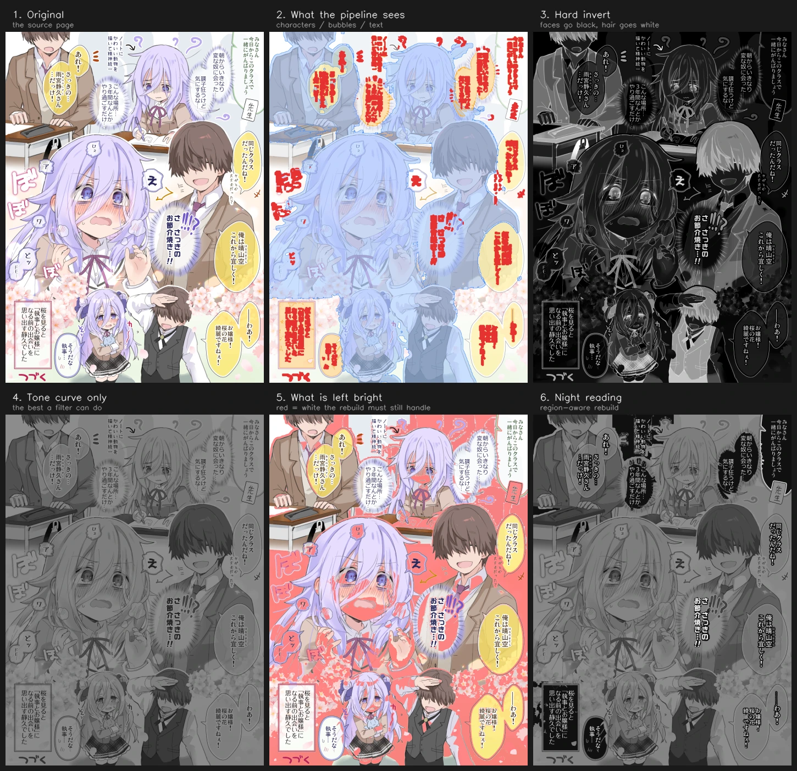
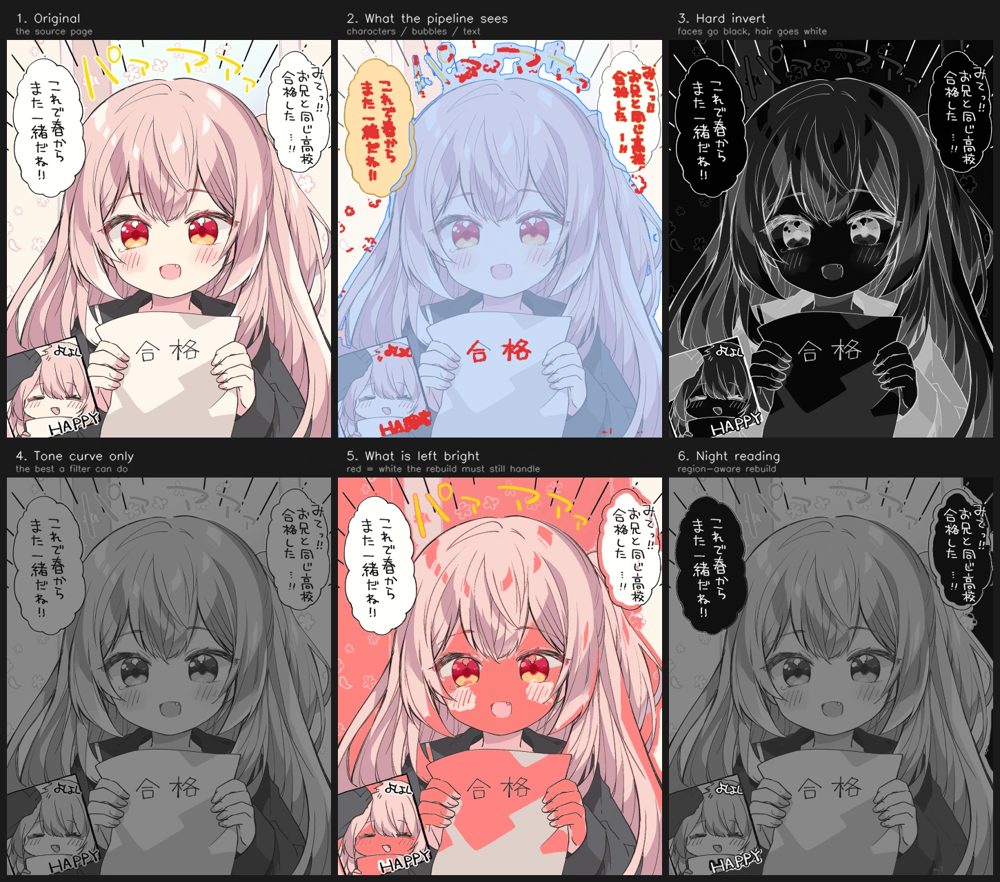

# Showcase

English ｜ [中文](SHOWCASE_zh.md)

Eleven test pages, each broken into six panels: the source, what the pipeline sees, a hard invert, a tone
curve alone, how much white is left, and the finished rebuild. Panels three and four are the control group —
they are there to show why a filter cannot do this. Inversion wrecks the art; a tone curve can only grey the
whole page down.

Panel five marks every pixel that is **still bright in the output but was white in the source**. Less red
means a more complete rebuild. The red on the characters is deliberate: that is the region the red line
protects.

How to run it is in the [README](../README.md); what each stage decides is in
[ARCHITECTURE.md](ARCHITECTURE.md).

## Black-and-white pages

Dialogue-heavy, fully framed, large white backgrounds — the typical case.

### ch34_006
The background wedge above the old man's head took three reports to fix correctly. The cause was the core
fill's geodesic-ratio test treating it as white attached to a character.

### ch34_010
A bleed close-up with no frame. The character's white clothing runs continuously into the page white and the
outline is open, so there is no boundary at the pixel level. Only the semantic mask holds it.

### ch34_011
The round bubble on the right has a gap in its frame, and the white inside leaks through it into the
background. Neck-cutting separates them, and the bubble still fills completely.

### ch34_014
The bottom-right bubble was once recognized as only 10% bubble, leaving a grey-white ring inside its frame.
Loosening the area ratio to 2.5 fills it.

### ch34_015
The bottom-left panel has two bubbles touching, sharing one white component. The core fill cuts them apart at
the neck and fills only the one holding the text.

## Text over artwork

The text is not inside a bubble, it is drawn straight onto the art. There is no enclosed white component to
work with, so a pseudo-bubble grows a close-fitting dark backing instead.

### demo01
A bleed close-up with text over the face. The bubble mask grows from the text across the entire sheet of
skin — this page is why simply letting bubbles win over characters breaks 17 guard boxes.

### demo02
A crowd panel. Dense small figures all count as characters to protect, so leaving that panel grey is correct
behaviour, not a missed fill.

### demo03
A clean oval bubble. Once judged a real bubble it is filled entirely and not clipped by the character mask.
Text contrast inside it goes from 22 to 40.

### demo06
A church sketched in faint, dense linework. Filling it black would swallow the sketch, so that area is left
to the scene curve.

## Colour and frameless pages

### demo04
A frameless page: the background is only darkened, never filled. The light-area figure looks high because
characters occupy more than 60% of the page.

### demo05
Watercolour. The paper-white peak is only 223, and the chroma gate in paper-white normalization is what
saves this page: without it the whole wash would be lifted to white and the output would come out brighter
than before.

## How to read the panels

**Panel two (what the pipeline sees)** overlays three colours on a faded source: blue is characters, orange
is bubbles, red is text strokes. Their priority order is text > bubble > character > background.

**Panel five (what is left bright)** is a diagnostic, not an output. It marks pixels that were white in the
source and are still bright in the result. Large areas of red on a character are expected — that is the red
line doing its job. Red on the background is what remains to be worked on.
